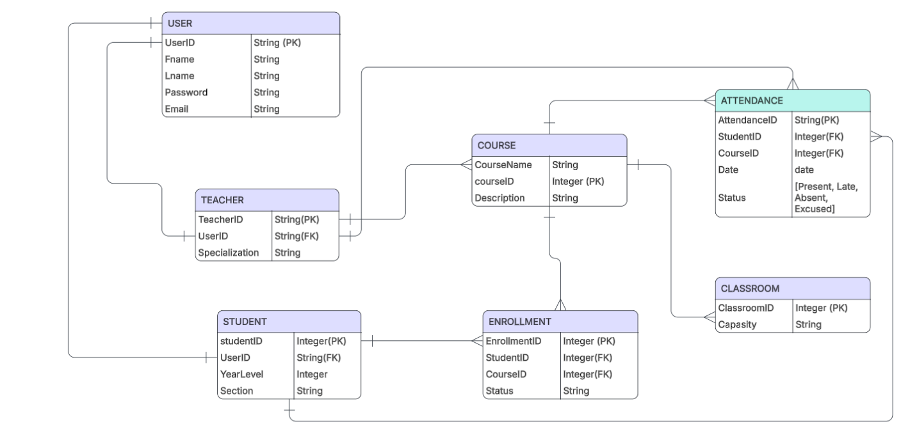

# TeacherAttendanceCheckerSystem-IT342-G01-Group7


# ERD 




# Teacher Attendance Checker System

A group project aimed at streamlining the process of tracking teacher attendance through a web and mobile platform. The system features an admin panel for user management, teacher registration, and attendance checking functionality for educational institutions.

---

## 🛠 Tech Stack

- **Frontend:** React.js (JavaScript, CSS, HTML)
- **Backend:** Spring Boot (Java)
- **Mobile:** Kotlin (Android)
- **Database:** (not specified in repo, assumed JDBC-compatible)
- **Others:** JWT authentication, RESTful API

---

## 🚀 Setup & Run Instructions

### Backend (Spring Boot)
1. Clone the repo:
   ```bash
   git clone https://github.com/tetWantsToCode/TeacherAttendanceCheckerSystem-IT342-G01-Group7.git
   cd TeacherAttendanceCheckerSystem-IT342-G01-Group7/backend/attendance-checker
   ```
2. Run with Maven or your IDE:
   ```bash
   ./mvnw spring-boot:run
   ```
   or import into your favorite Java IDE and run `AttendanceCheckerApplication`.

3. The backend will run by default at: `http://localhost:8080/`

---

### Frontend (React.js)
1. Go to the frontend folder:
   ```bash
   cd ../web/tacs-app
   ```
2. Install dependencies:
   ```bash
   npm install
   ```
3. Run the app:
   ```bash
   npm run dev
   ```
   Visit [http://localhost:5173/](http://localhost:5173/) in your browser.

---


---

## 👨‍💻 Team Members

- [@clintperales441](https://github.com/clintperales441) — *Developer* — clintperales441@cit.edu 
- [@tetWantsToCode](https://github.com/tetWantsToCode) — *Developer* — neilrossulysses.pael@cit.edu
- [@Lumity-13](https://github.com/Lumity-13) — *Developer* — felixchristian.go@cit.edu
- [@YBMACO](https://github.com/YBMACO) — *Developer* — yusufbinmohammadali.oswa@cit.edu


---

## 🌐 Deployed Link

*No deployed link available at this time.*  
>If you deploy (e.g., on Vercel/Netlify/Heroku), update this section with the live URL!

---

